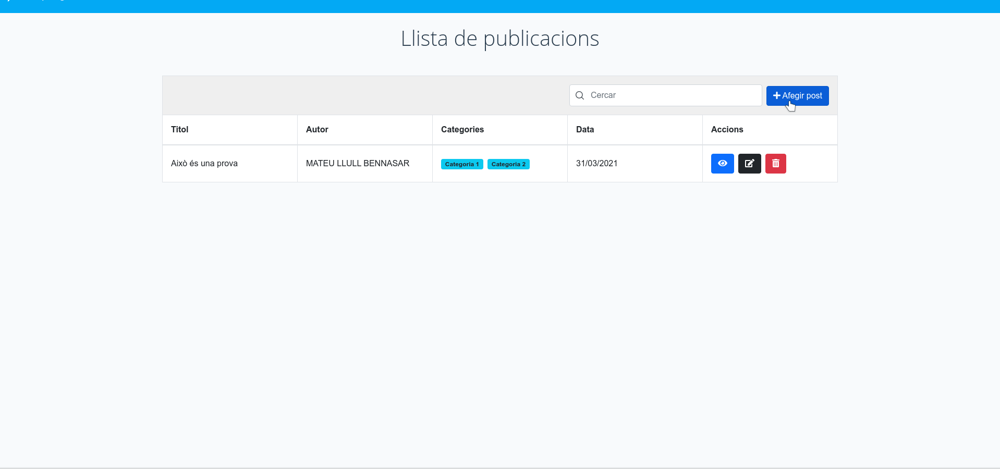

# App Vue3 del curs

Exemple d'aplicació:



## Project setup
```
yarn install
```

### Compiles and hot-reloads for development
```
yarn serve
```

## Tasques a realitzar:

* Acabar la part de visualització de Post + Afegir/visualitzar comentaris
* Fer la part d'edició de Post, basant-se en el component `AfegirPost`.
